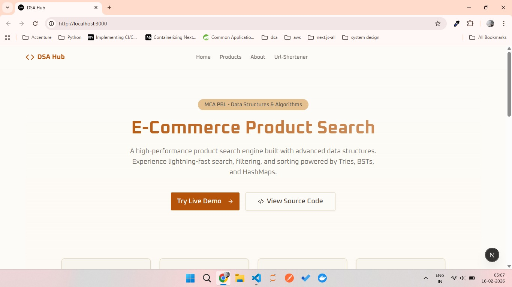
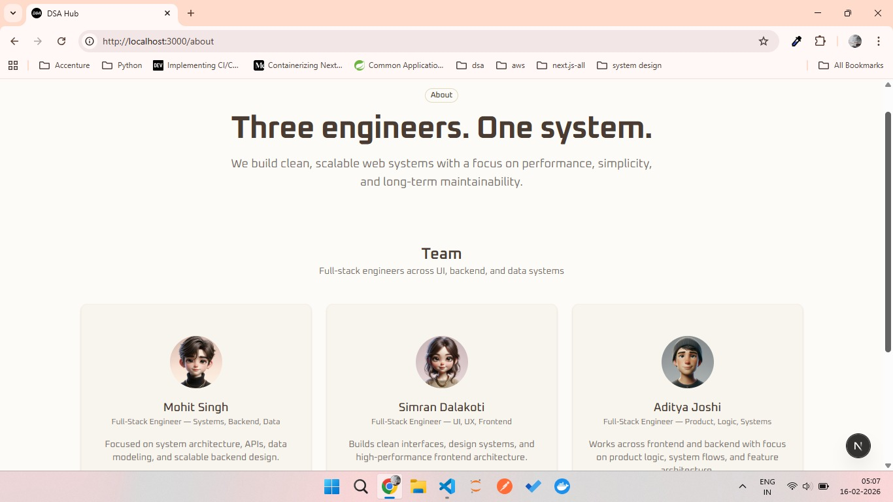
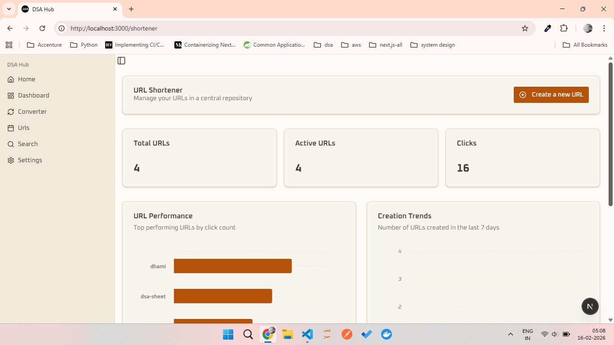
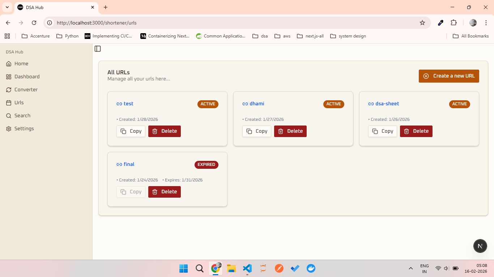
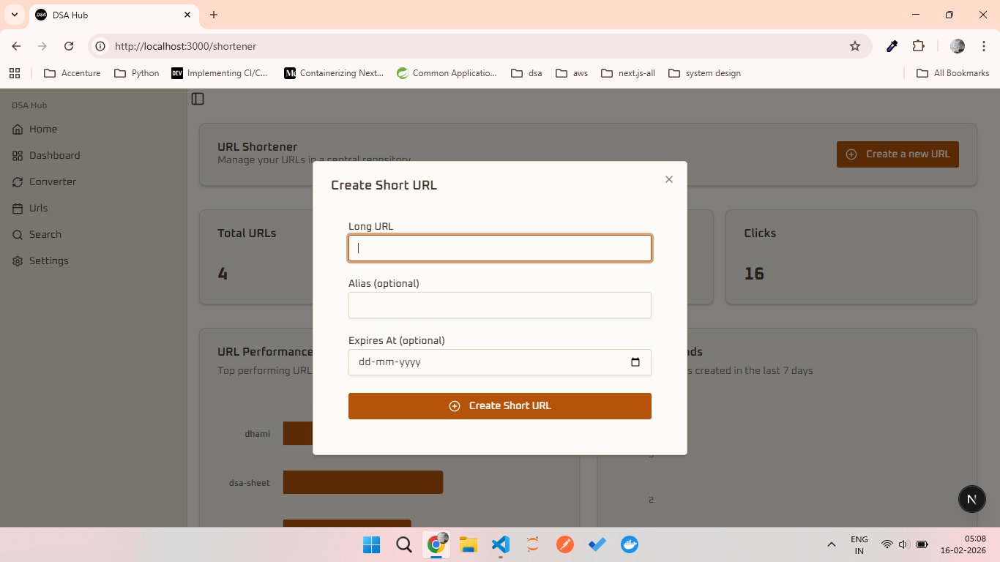
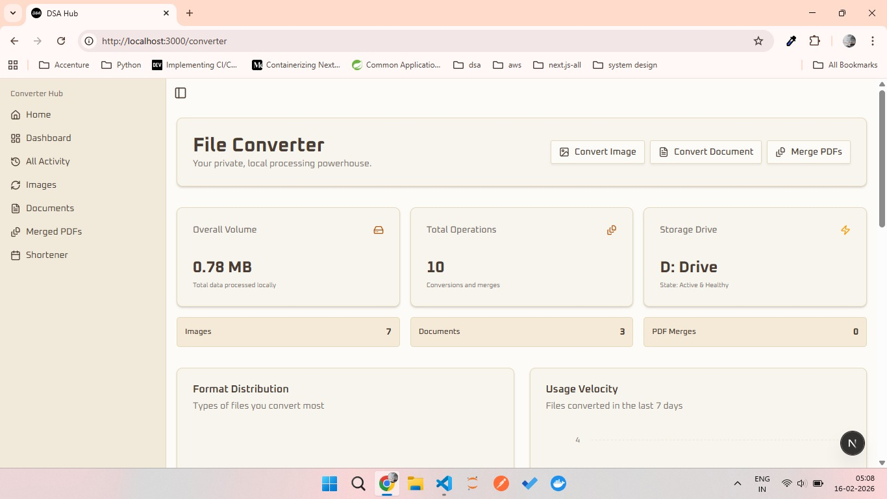
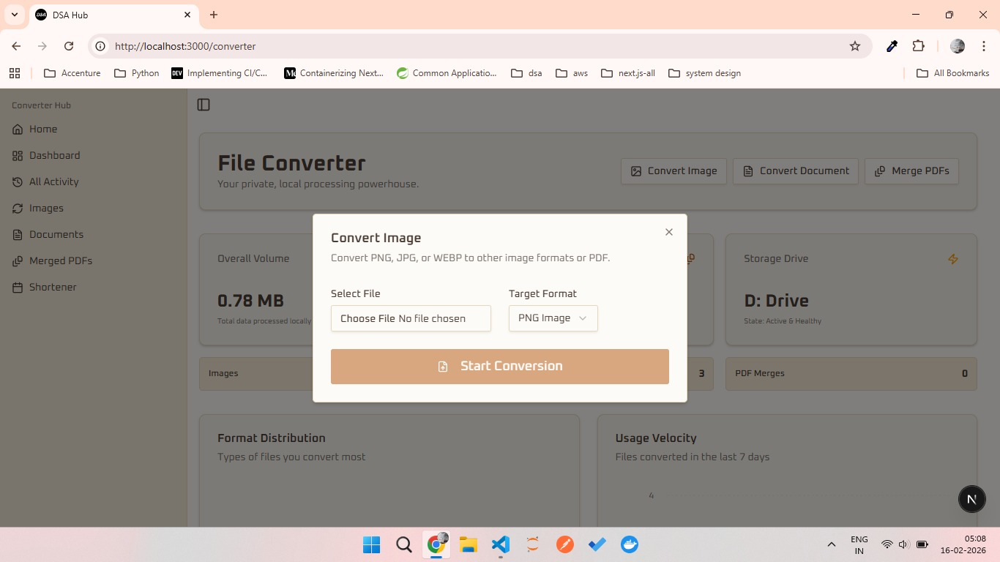
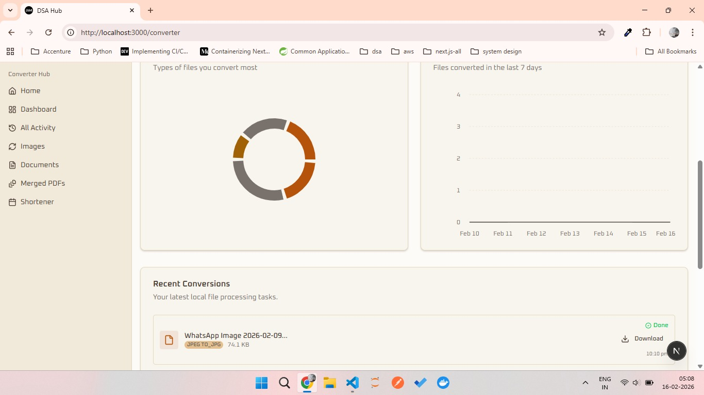
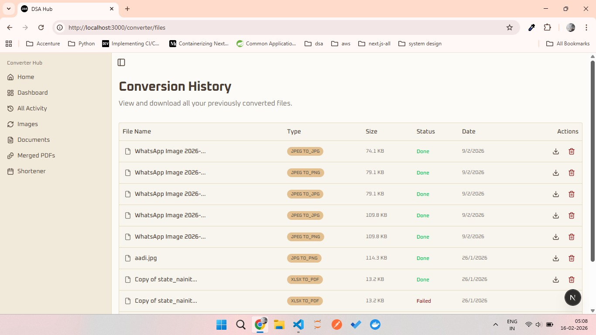

# 🚀 Modular Digital Platform  
### A System Design–Focused Project-Based Learning (PBL) Application  

---

## 📌 Overview  
The **Modular Digital Platform** is a unified application that integrates multiple real-world utilities into a single system.

Unlike traditional projects that focus on isolated features, this platform is designed around:

- Modular architecture  
- System integration  
- Scalability  
- Real-world software design  

It simulates how modern applications are built—where independent modules work together and can later evolve into microservices.

---

## 🎯 Problem Statement  

Users today depend on multiple platforms for:
- File conversion  
- URL shortening  
- Product browsing  

This leads to:
- Fragmented workflows  
- Platform switching  
- Data silos  

At the same time, most academic projects lack:
- System-level thinking  
- Integration of multiple services  

This project solves both by combining practical utility with system design learning.

---

## 💡 Objectives  

- Build a modular and scalable system  
- Learn real-world architecture patterns  
- Apply data structures in real systems  
- Understand integration workflows  
- Prepare for microservices architecture  

---

## 🧩 Core Modules  

### 🛒 E-Commerce Module  
**Features:**
- Advanced search, sorting & filtering  
- Category-based browsing  
- Price range filtering  
- External API integration  

**Learning Focus:**
- Searching & sorting algorithms  
- Data indexing  
- Efficient data handling  

---

### 🔗 URL Shortener Module  
**Features:**
- Short URL generation  
- CRUD operations  
- Expiry-based links  
- Redirection system  
- Ownership-based access  

**Learning Focus:**
- Hashing & key generation  
- HashMaps & mappings  
- Access control logic  

---

### 📁 File & Image Converter  
**Features:**
- Document & image conversion  
- File storage & lifecycle management  
- Conversion logs  

**Learning Focus:**
- File systems & I/O streams  
- Binary data processing  
- Pipeline-based processing  

---

## 🏗️ Architecture  

### Current: Modular Monolithic  
- Shared frontend  
- Modular backend structure  
- Central routing  

### Future: Microservices  
- E-commerce Service  
- URL Service  
- File Service  
- Auth Service  
- API Gateway  

---

## 🧠 Data Structures Used  

- HashMap → URL mapping, caching  
- Set → Unique filtering  
- Binary Search Tree → Sorted data  
- Heap → Priority sorting  
- Arrays/Lists → Collections  
- Queue → Processing pipelines  
- Tree Structures → Category hierarchy  

---

## 🛠️ Tech Stack  

### Frontend  
- Next.js  
- React  
- Tailwind CSS  

### Backend  
- Spring Boot (E-commerce)  
- Next.js API Routes (URL + File modules)  

### Database  
- PostgreSQL  

### Tools  
- Prisma ORM  
- GitHub  
- REST APIs  

---

## 🔗 Integration Strategy  

- Independent modules with shared UI  
- Central routing system  
- Unified data flow  
- Modular service design  

---
## 📸 Screenshots

### Hero & About

  
  

### URL Shortener Module

  
  
  

### File & Image Converter Module

  
  
  
  

---

## 🔮 Future Scope  

- Authentication & Authorization  
- Role-Based Access Control  
- Cloud Storage Integration  
- Microservices architecture  
- API Gateway  
- Message queues  
- Caching systems  
- Docker & deployment pipelines  
- Monitoring & logging  

---

## 👥 Team  

| Name | Role | Responsibility | 
|------|------|--------------|
| Aditya Joshi | UI/UX Designer | Designed application UI in Figma, created wireframes, and defined user experience flows |
| Simran Dalakoti | Frontend Engineer | Built responsive UI components, implemented designs, and handled frontend-backend API integration |
| Mohit Singh | System Architect | Designed system architecture, handled backend structure, and managed module integration |

---

## 📚 Learning Outcomes  

- System design thinking  
- Modular development  
- Real-world architecture  
- Data structure implementation  
- Scalable system design  
- Team collaboration  

---

## 🏁 Conclusion  

This project focuses on how systems are built, not just features.

It serves as:
- A practical digital platform  
- A system design learning project  

> “This project is not about building tools — it’s about learning how systems are built.”
